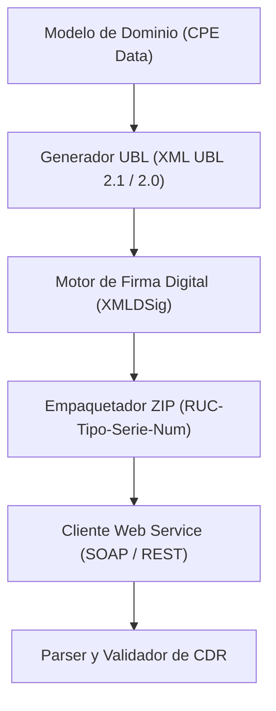
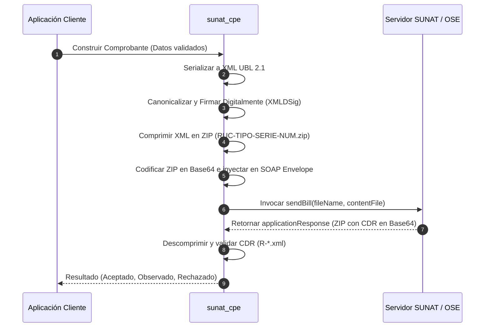

# Manual Técnico - `sunat_cpe`

Manual técnico y de arquitectura para la librería `sunat_cpe`, desarrollada en Rust para la emisión, firma, validación y envío de Comprobantes de Pago Electrónicos (CPE) bajo los estándares de la Superintendencia Nacional de Aduanas y de Administración Tributaria (SUNAT - Perú).

---

## 1. Arquitectura del Sistema

La librería está estructurada en capas desacopladas con el principio de responsabilidad única, garantizando seguridad en tiempo de compilación y cero costo en abstracciones críticas.

### Capas Principales:
1. **Modelos de Dominio (`cpe_modelos`)**: Representación tipada de Facturas, Boletas, Notas de Crédito, Notas de Débito, Guías de Remisión, etc. (`CpeFactura`, `CpeBoleta`, `CpeNotaCredito`, `CpeGuiaRemision`, etc.).
2. **Catálogos Oficiales SUNAT (`cpe_catalogos`)**: Implementación exhaustiva de los Catálogos SUNAT (No. 01 al 60: tipos de documento, monedas, afectación al IGV, unidades de medida, tipos de nota de crédito/débito, regímenes de retención/percepción, motivos de traslado, detracciones, etc.) con variantes `Desconocido(String)` para garantizar compatibilidad hacia adelante ante nuevas resoluciones.
3. **Generador UBL (`cpe_ubl`)**: Transformación de modelos a XML OASIS UBL 2.0 y 2.1 mediante traits adaptadores (`CpeUblSerializador`) desacoplados de la versión del esquema.
4. **Motor de Firma Digital (`cpe_firma`)**: Implementación de XMLDSig (Enveloped Signature), canonicalización C14N y firma RSA-SHA256 con certificados X.509 (`.pfx` / `.p12`).
5. **Empaquetado y Compresión (`cpe_empaquetado`)**: Generación de archivos comprimidos ZIP (`{RUC}-{TIPO}-{SERIE}-{NUMERO}.zip`).
6. **Cliente de Servicios Web (`cpe_ws`)**: Gestión de conexiones SOAP (BillService) y REST (API Guías de Remisión) con soporte para entornos de **Pruebas (Beta)** y **Producción**.
7. **Recepción y Validación de CDR (`cpe_cdr`)**: Descompresión y lectura del XML de Constancia de Recepción (CDR) para determinar aceptación, observaciones o rechazo.
8. **Manejo de Errores (`cpe_error`)**: Enum tipado `CpeError` para modelar fallos de validación de negocio, criptográficos, de red y códigos de error SUNAT.

---

## 2. Flujo del Proceso de Emisión (Algoritmo General)

---

## 3. Algoritmos Clave y Especificaciones Técnicas

### 3.1 Algoritmo de Generación XML UBL
- **Objetivo**: Producir un documento XML válido sintáctica y semánticamente según los esquemas XSD de SUNAT basados en OASIS UBL 2.1.
- **Pasos**:
  1. Mapeo de campos del modelo Rust a los nodos UBL correspondientes (`cac:`, `cbc:`).
  2. Inserción del nodo `ext:UBLExtensions` reservado para la firma digital.
  3. Formateo numérico estricto (importes con 2 o más decimales según catálogo, sin separadores de miles).
  4. Inclusión de Códigos de Leyendas (Catálogo No. 52).

### 3.2 Algoritmo de Firma Digital (XMLDSig Enveloped)
- **Normativa**: SUNAT Resolución de Superintendencia Nº 097-2012/SUNAT y modificatorias.
- **Pasos del Algoritmo**:
  1. **Canonicalización del Documento**: Aplicar C14N (Canonical XML sin comentarios: `http://www.w3.org/TR/2001/REC-xml-c14n-20010315`) omitiendo el bloque donde se insertará la firma (`<ext:UBLExtension>`).
  2. **Cálculo del Digest Value**:
     $$\text{DigestValue} = \text{Base64}(\text{SHA256}(\text{C14N}(\text{XML})))$$
  3. **Construcción del nodo `<SignedInfo>`**:
     - Método de canonicalización: `http://www.w3.org/TR/2001/REC-xml-c14n-20010315`.
     - Algoritmo de firma: `http://www.w3.org/2001/04/xmldsig-more#rsa-sha256`.
     - DigestMethod: `http://www.w3.org/2001/04/xmlenc#sha256`.
  4. **Firma del `<SignedInfo>`**:
     $$\text{SignatureValue} = \text{Base64}(\text{RSASign}_{\text{PrivateKey}}(\text{C14N}(\text{SignedInfo})))$$
  5. **Extracción del Certificado X.509**: Incrustar el certificado público en `<KeyInfo><X509Data><X509Certificate>`.
  6. **Incrustación**: Insertar el bloque `<ds:Signature>` completo en el primer `UBLExtension` del comprobante.

### 3.3 Algoritmo de Empaquetado ZIP
- **Nomenclatura Obligatoria**:
  $$\text{NombreArchivo} = \text{RUC}_{11} - \text{TipoCPE}_2 - \text{Serie}_4 - \text{Correlativo}_{1..8}$$
  - Ejemplo: `20123456789-01-F001-00000001.xml`
- **Compresión**: Formato ZIP estándar conteniendo únicamente el archivo XML firmado, nombrado idénticamente con extensión `.zip`.

### 3.4 Algoritmo de Comunicación Web Service (SOAP y REST)
- **Métodos SUNAT SOAP (`billService`)**:
  - `sendBill`: Envío sincrónico de Facturas, Boletas y Notas asociadas. Devuelve el CDR de inmediato en la respuesta.
  - `sendSummary`: Envío asincrónico de Resúmenes Diarios de Boletas y Comunicaciones de Baja. Devuelve un número de ticket.
  - `getStatus`: Consulta del estado del ticket generado por `sendSummary`.
  - `sendPack`: Envío de Guías de Remisión Electrónica / Lotes.
- **Autenticación SOAP**: Cabeceras `wsse:Security` con `UsernameToken`:
  - `Username`: `[RUC][USUARIO_SOL]` (ej. `20123456789MODDATOS`)
  - `Password`: `[CLAVE_SOL]` (ej. `moddatos`)
- **Matriz Oficial de Endpoints**:
  | Servicio / Comprobante | Entorno Beta (Pruebas) | Entorno Producción |
  | :--- | :--- | :--- |
  | **Facturas, Boletas, NC, ND** | `https://e-beta.sunat.gob.pe/ol-ti-itcpfegem-beta/billService` | `https://e-factura.sunat.gob.pe/ol-ti-itcpfegem/billService` |
  | **Retenciones y Percepciones** | `https://e-beta.sunat.gob.pe/ol-ti-itemision-otroscpe-gem-beta/billService` | `https://e-factura.sunat.gob.pe/ol-ti-itemision-otroscpe-gem/billService` |
  | **Consulta de Validez / CDR** | `https://e-beta.sunat.gob.pe/ol-ti-itwsconsvalidcpe-beta/billConsultService` | `https://e-factura.sunat.gob.pe/ol-it-wsconsvalidcpe/billConsultService` |
  | **Guías de Remisión (REST Token)** | `https://api-seguridad.sunat.gob.pe/v1/clientessol/{id}/oauth2/token` | `https://api-seguridad.sunat.gob.pe/v1/clientessol/{id}/oauth2/token` |
  | **Guías de Remisión (REST Envío)** | `https://api-cpe.sunat.gob.pe/v1/contribuyente/gem/comprobantes` | `https://api.sunat.gob.pe/v1/contribuyente/gem/comprobantes` |

### 3.5 Algoritmo de Procesamiento de CDR (Constancia de Recepción)
- **Estructura del CDR**: Archivo `R-[RUC]-[TIPO]-[SERIE]-[NUMERO].zip` retornado en Base64 dentro del elemento `applicationResponse`.
- **Evaluación del Código de Respuesta (`cbc:ResponseCode`)**:
  - `0`: **Aceptado** (Comprobante válido y aceptado por SUNAT).
  - `0100` a `1999`: **Aceptado con observaciones** (Válido tributariamente, pero requiere subsanar advertencias).
  - `>= 2000`: **Rechazado** (Comprobante inválido, no tiene validez tributaria).

### 3.6 Algoritmo de Precisión Numérica y Aritmética Decimal (Antifloating-Point)
- **Motivación y Normativa SUNAT**:
  - Las Guías de Validación de SUNAT exigen consistencia estricta en las sumatorias:
    $$\text{PayableAmount} = \sum \text{LineExtensionAmount} + \sum \text{Tributos} - \sum \text{DescuentosGlobales} + \sum \text{CargosGlobales}$$
  - El uso de punto flotante binario IEEE 754 (`f32`, `f64`) genera pérdida de precisión acumulativa (errores de centavos `0.01`), provocando el rechazo con códigos de error SUNAT (ej. Error 2014: *El valor del IGV no coincide*, Error 2015: *El total del documento no coincide con la sumatoria de ítems*).
- **Especificaciones del Algoritmo**:
  1. **Aritmética Decimal en Base 10**: Todo cálculo y almacenamiento de importes se realiza exclusivamente con representación decimal exacta (ej. `rust_decimal` de 128 bits o enteros escalados).
  2. **Valores Unitarios**: Admite hasta 10 decimales en `cbc:PriceAmount` y `cbc:AlternativeConditionPrice`.
  3. **Cantidades**: Hasta 10 decimales en `cbc:InvoicedQuantity`.
  4. **Importes Totales e Impuestos**: Redondeo comercial estricto a **2 decimales** utilizando la estrategia *Half Up* (mitad hacia arriba):
     $$\text{ImporteRedondeado} = \text{round\_half\_up}(x, 2)$$
  5. **Cálculo de IGV por Línea vs Global**: Garantizar que la sumatoria de bases imponibles y el impuesto liquidado cumplan con las tolerancias y reglas de redondeo de la matriz de validaciones de SUNAT.

---

## 4. Convenciones de Código y Documentación en Rust

1. **Documentación de Crate y Módulos (`//!`)**: Cada módulo expone su propósito técnico, ejemplos de uso y los catálogos SUNAT que implementa.
2. **Documentación de Elementos Públicos (`///`)**: Todas las funciones, structs, enums y traits públicos cuentan con docstrings explicando:
   - Parámetros y tipos.
   - Errores retornados (`# Errors`).
   - Ejemplos ejecutables vía doc-tests (`# Examples`).
3. **Comentarios de Implementación (`//`)**:
   - Se reservan para explicar el *por qué* de decisiones de diseño, algoritmos matemáticos/criptográficos o particularidades de la normativa técnica SUNAT.
4. **Manejo de Errores con Tipos Dedicados**:
   - `CpeError`: Enum tipado con `thiserror` que desglosa errores de validación local, serialización XML, firma criptográfica, empaquetado, transporte de red y respuestas devueltas por SUNAT.

---

## 5. Mantenimiento del Manual

Este manual debe mantenerse actualizado de forma continua ante:
- Incorporación de nuevos módulos o algoritmos.
- Actualizaciones de esquemas normativos por parte de SUNAT (nuevas resoluciones de superintendencia).
- Cambios en las firmas criptográficas o protocolos de transporte (ej. migración a REST API de Guías de Remisión).
